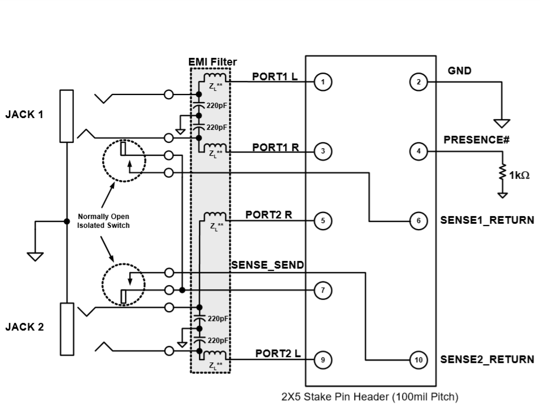

# Audio issues
## Introduction
At the outset of the project, it was decided that attempting to salvage parts 
from the original board wouldn't have been worth the effort and risk of damage 
during desoldrring, so equivalent compenents would have to be sourced.

The 3.5mm Audio connectors had to be mechanically identical otherwise they 
wouldn't fit properly against the case plastic.

The CUI SJ1-3545N connectors are mechanically identical to the original 
connectors and were expected to be a zero-effort substitution.

This was not the case.

## Connection issues
During testing of the audio portion of the circuit, the PC reported constant 
disconnection and reconnection of a device when a set of headphones were 
connected to the jack.

After some investigation I came across Intel's [Front-Panel IO Design Guide](Intel_Front_Panel_IO_Connectivity_Design_Guide.pdf)
which describes the theory of operation behind the HD Audio interface standard.

### HD Audio Device Sensing

The Intel HD Audio interface allows front panel jacks to signal user connection 
and disconnection to the Operating System using the SENSE_SEND signal of the 
header.

_Figure 1_ shows Intel's reference implementation of a Front-Panel dongle using 
the HD Audio interface, showing the connections from the dongle header to the 
indiviual audio jacks.

_Figure 1: Intel® HD Audio Front Panel Dongle Implementation_

The previous figure shows that the reference implementation uses "Normally Open 
Isolated Switch" style jacks that connect the SENSE_SEND signal and SENSE_RETURN
signals together so that the CODEC on the motherboard can detect the insertion 
of a plug into the jack.

The connectors selected for this design however are normally closed against the 
Tip and Ring pins of the plug and cause the CODEC to malfunction and cause the 
continual connection and disconnection event generation as described earlier.

## Solution
In this case, a suitable replacement connector which met the specific 
mechanical requirements of the project, as well as the requirement for a 
Normally Open Isolated Switch could not be found.

So I stole the old connectors from the original board.:man_shrugging: